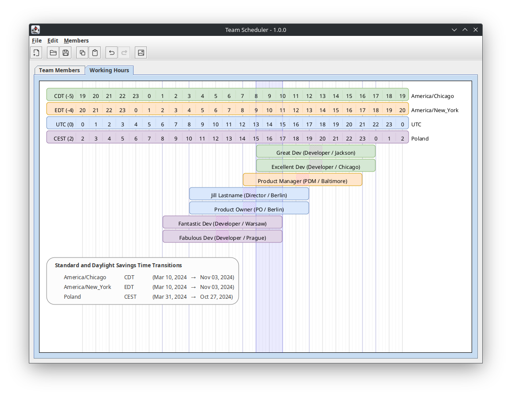

Swing Working Hours is a Java/Swing desktop application that generates diagrams 
showing the normal working hours (and lunch hour) for each member of a team.

As of version 1.0.0, this project has hit MVP with all the features necessary to
create these diagrams. There is, however, always more [to do](docs/TODO.md).

Thanks to [Iconoir](https://iconoir.com/) for the menu and toolbar icons.

# Background
This project started with a daily working hours diagram created for a client in Draw IO.
This allowed the team to see where our schedules lined up and thus how much time we had
to actively collaborate ("Collaboration Zones"). This was especially useful when deciding
what Agile ceremonies we had time for and when they should be scheduled.

The following is the original Draw IO diagram.

A quick look at the diagram told us that the scrum master was going to have
access to the entire team only 1.5-2 hours per day. Our daily ceremonies were going to
have to be very lean to keep from chewing up that precious overlap time.

Based on this experience, it seemed pretty obvious that we could make great use of an
application that generated these diagrams.