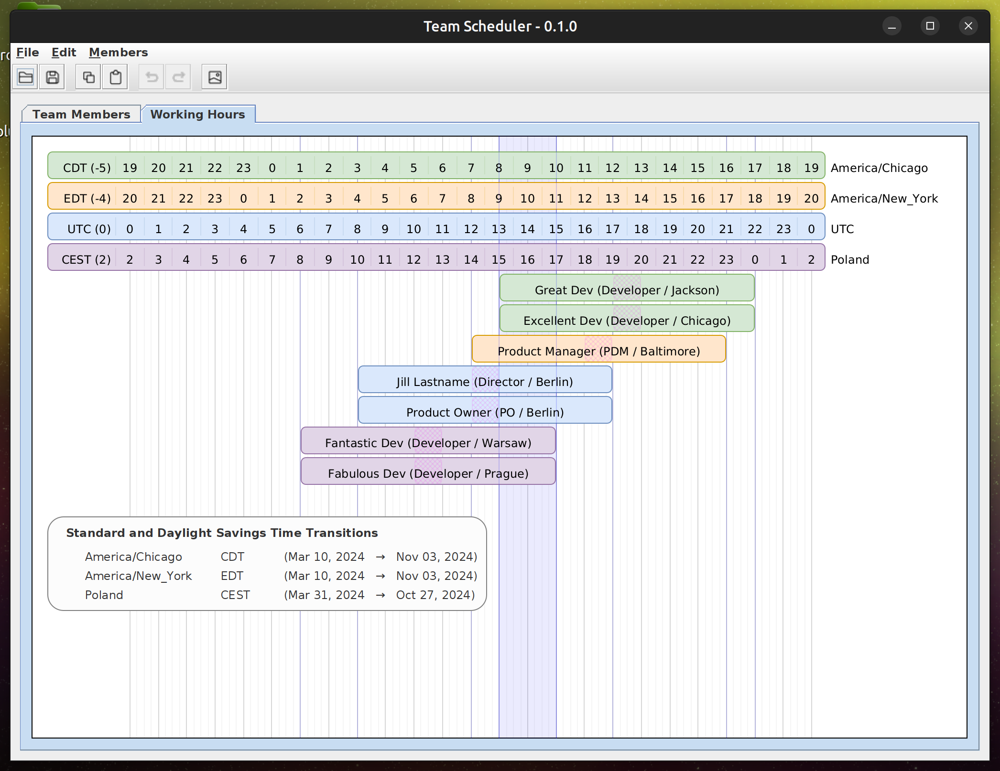

A Java/Swing desktop application that generates diagrams showing the 
normal working hours of the members of a team. 

# Background
This project started with a daily working hours diagram created for a client in Draw IO.
This allowed the team to see where our schedules lined up and thus how much time we had
to actively collaborate ("Collaboration Zones"). This was especially useful when deciding
what Agile ceremonies we had time for and when they should be scheduled.

The following is the original Draw IO diagram.

A quick look at the diagram told us that the scrum master was going to have
access to the entire team only 1.5-2 hours per day. Our daily ceremonies were going to
have to be very lean to keep from chewing up that precious overlap time.

Based on this experience, it seemed pretty obvious that we could make great use of an
application that generated these diagrams.

# Current Features
The latest release is at a point that is useful for its original purpose 
but by no means complete.

This version has the following features implemented.

* Undo / Redo
* Table editing for team members
  * add/remove, reorder, etc.
  * Import / Export CSV
* Working Hours Diagram
  * Rudimentary PNG Export
  * Displays every Time Zone with a member in it plus UTC.  
  * Displays normal and "lunch hour"
  * Displays daylight savings time transition dates for all included zones.
  * Collaboration Zones
    * Displays the largest zone (the most team members present for the longest duration).
    * Calculates all zones that start at one shift change and end at the next.
  * Center the canvas on a user-selected time - IN PROGRESS
    * Under the hood updates complete awaiting mouse handlers.
* Icons for the toolbar / menu bar
  * The current set is from https://iconoir.com/

# Features Wishlist

* Color icons for the toolbar / menu bar 
* Context locations for Undo / Redo
  * i.e. "Go to where the change was"
* Canvas / Display
  * Complete handling for "Working Hours" that span days.
    * The text isn't right yet
  * Collaboration Zones
    * Allow the user to choose which zones to display
    * Calculate zones for contiguous time periods that have the same team members.
      * These zones would overlap two or more of the zones that are currently being calculated. 
  * Center the canvas on a user-selected time
    * now it's always 0->12->0 UTC
  * Mouse handlers for changing the center canvas time
    * For teams that aren't working (entirely) in north america
  * Mouse handlers for changing a member's working hours
* Table Editing
  * Improved zone selector with search/sort
  * Proper spreadsheet-esque copy/paste
* Data Entry
  * Multi-select and import employees folks from Salesforce
  * Pull their "home" region / time zone from Salesforce
  * Pull their normal working hours from Outlook (if easily available)
  * Multi-select any number of additional time zones
* Output separate diagrams for each section of a year
  * Include start/end dates
  * Automatically start a new diagram any time daylight savings time starts in one of the selected zones.
* Include arbitrary time indicator lines (shown as vertical lines below)
  * Can be used to mark "Overlap Zones" or anything else necessary.
* Export formats
  * Excel
  * SVG
  * Full Featured PNG
  * Draw IO (?)
* As a bonus, consider also generating a combined calendar with holidays for each region / country
  * Company Holidays
  * "Bank Holidays"
  * Holidays for the selected client (?)
