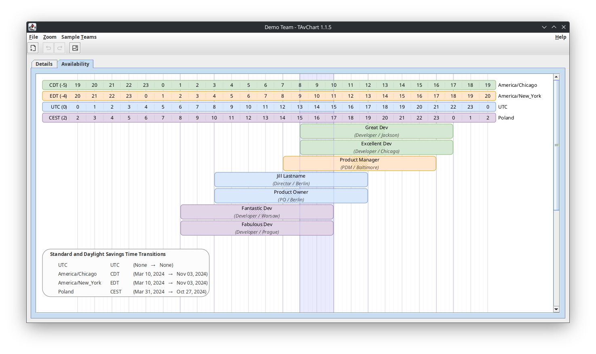

TAvChart is a Java/Swing desktop application that generates diagrams showing the 
normal availability for each member of a team and highlights the team's
Collaboration Zone (the time when they're all available).

This project hit MVP with 
[version 1.0.0](https://github.com/johndrothe/swing_working_hours/releases/tag/version-1.0.0),
having all the features necessary to create solid diagrams. The more recent
[releases](https://github.com/johndrothe/TAvChart/releases) have focused on usability and 
convenience features. There always more [to do](docs/TODO.md)...

As of [version 1.1.0](https://github.com/johndrothe/swing_working_hours/releases/tag/version-1.1.0),
TAvChart requires Java 22 or higher and is built with 
[Eclipse Temurin™](https://adoptium.net/temurin/releases/?version=22).

_Many thanks to [Iconoir](https://iconoir.com/) for many of the menu / toolbar icons and
[swing-dpi](https://github.com/lukeu/swing-dpi/tree/master) for the Zoom feature._

# Background
This project started with a daily working hours diagram created for a client in Draw IO.
This allowed the team to see where our schedules lined up and thus how much time we had
to actively collaborate ("Collaboration Zones"). This was especially useful when deciding
what Agile ceremonies we had time for and when they should be scheduled.

The following is the original Draw IO diagram.

A quick look at the diagram told us that the scrum master was going to have
access to the entire team only 1.5-2 hours per day. Our daily ceremonies were going to
have to be very lean to keep from chewing up that precious overlap time.

Based on this experience, it seemed pretty obvious that we could make great use of an
application that generated these diagrams.
